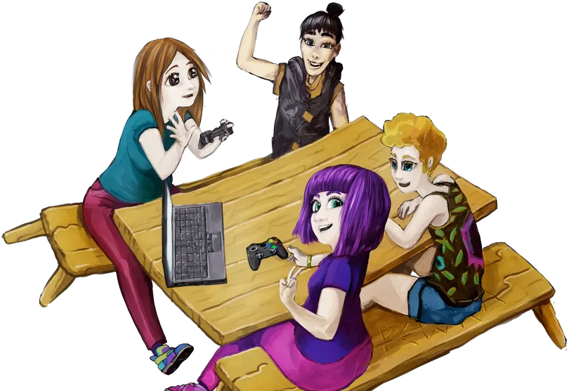

Brisbane LGBT & Allies in Tech is a meet-up for LGBT tech folks & allies thereof; to bring the community together and celebrate diversity in tech. It’s a great place to meet and network with like-minded people.

First time attendee? Too easy - we're an easygoing low key bunch of folks. Feel free to message an organiser if you have any questions.

Not sure if its for you? If your jam is working with tech & you're LGBTQIA+ or an ally, its definitely for you! Why not come along & find out? 🌈
